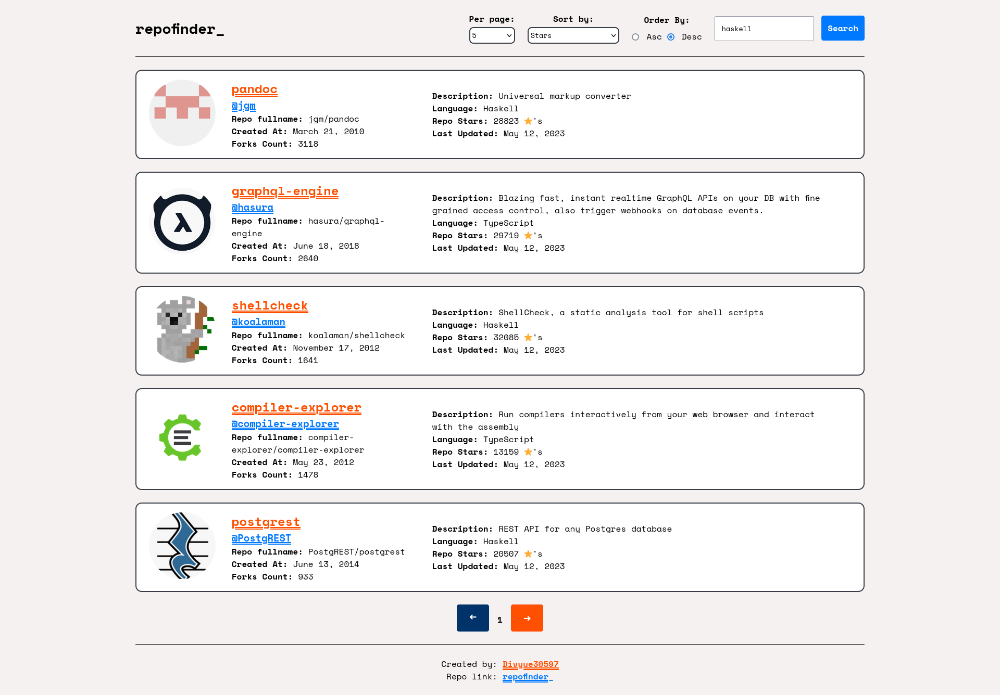

# repofinder\_

This project will help you to look for github repository and perform sorting (stars, forks, help-wanted-issue and last-updated) and ordering (ascending and descending). You can search for the repository manually too. You can even query for the number of repositories per page (maximum limit is 100 provided by github).

## Tech used

- React
- vite
- Github API
- Moment.JS
- axios

## To run locally

### Requirement

- Node.JS
- git

Clone the repo by selecting the `Code` button, and choosing `HTTPS` or `SSH` option.

```git
<!-- for SSH -->
git clone git@github.com:Divyue30597/github-repo-search-app.git

<!-- for HTTPS -->
git clone https://github.com/Divyue30597/github-repo-search-app.git
```

A new folder named `github-repo-search-app-main` - main is representing the branch here.

```terminal
<!-- Change directory into the repo locally -->
cd github-repo-search-app-main

<!-- install the dependencies -->
npm install

<!-- run the application locally -->
npm run dev
```

Once the application start, you will see nothing or you might see an error message. To solve that, create a file `.env.local`. In that file store the variable name `VITE_GITHUB_TOKEN` with your github personal token. You can refer this [documentation](https://docs.github.com/en/authentication/keeping-your-account-and-data-secure/creating-a-personal-access-token). You don't have to use `""` for the token's value.

```env
VITE_GITHUB_TOKEN=<YOUR-TOKEN>
```

### Screenshot of application



### Tasks done

- Implemented the sorting and ordering.
- Implemented simple pagination
- Added `loading="lazy"` attribute to image, so it loads when it is in the viewport.
- Used `grid` and `flexbox` for designing.
